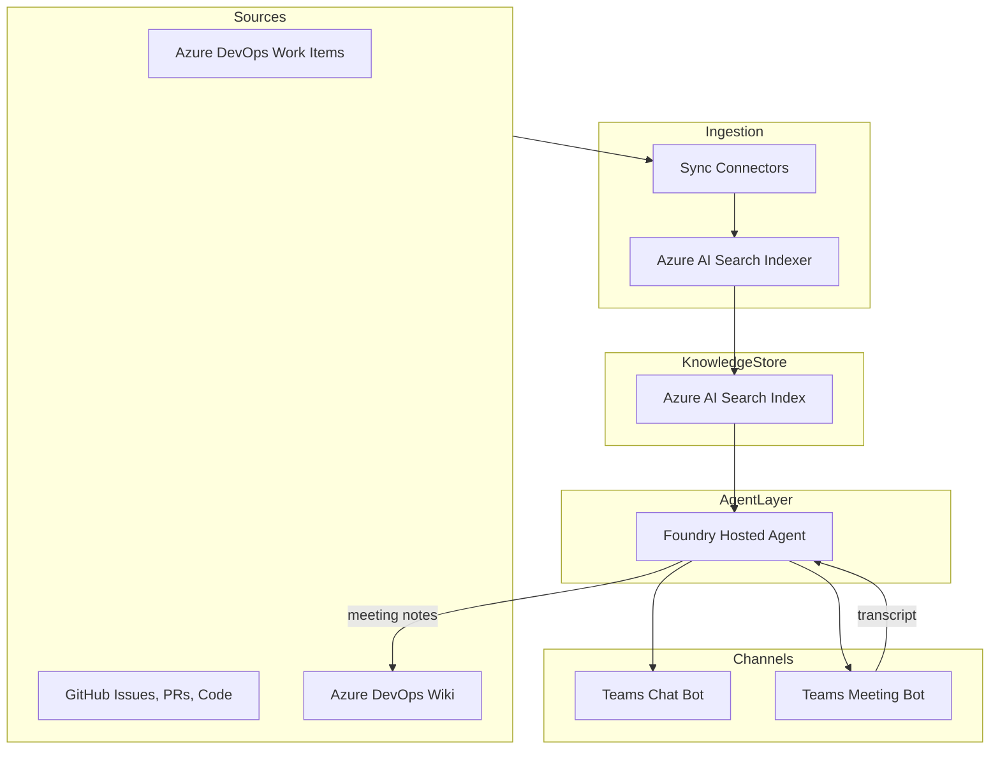
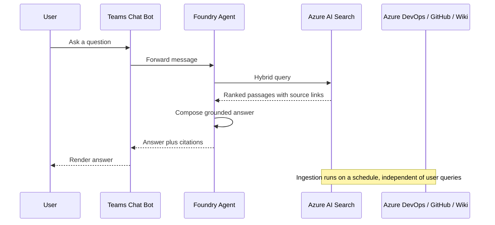
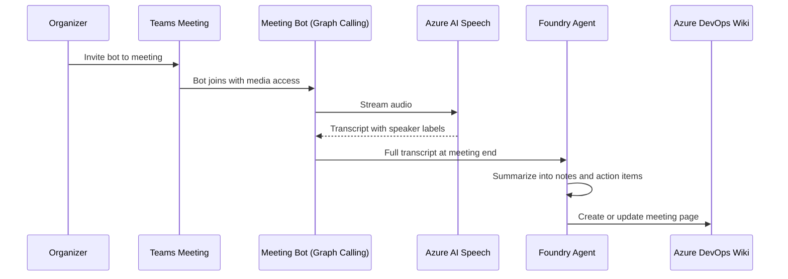
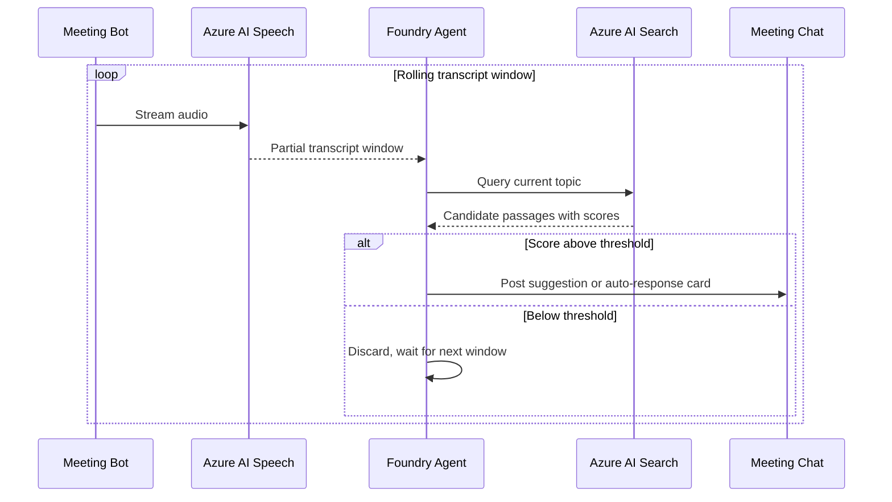

## Overview

Knowledge IQ is a Microsoft Teams bot that connects an organization's Azure DevOps work items, GitHub repositories, and Azure DevOps wiki into a single conversational assistant. The bot answers questions in chat, joins meetings to capture discussion and write summaries back to the wiki, and offers live suggestions during meetings by grounding the conversation in existing wiki knowledge.

The plan below is organized into three phases that map to the three requested features. Phase 1 is the recommended starting point because it delivers standalone value and produces the retrieval and indexing components that Phases 2 and 3 depend on.

## Goals and non-goals

* Goal: answer natural-language questions using Azure DevOps work items, GitHub issues/PRs/code, and Azure DevOps wiki pages as grounding sources.
* Goal: join a Teams meeting on invitation, capture a transcript, and publish structured notes back to the wiki.
* Goal: during a meeting, detect the topic under discussion and surface relevant wiki knowledge automatically or on request.
* Non-goal (initial phases): editing or closing work items on behalf of users, voice output/TTS responses in meetings, support for meeting platforms other than Teams.

## Recommended stack

| Concern | Recommendation | Why |
|---|---|---|
| Agent orchestration | Microsoft Foundry hosted agent | Managed agent runtime with tool calling, evaluation, and CI/CD support already covered by the `microsoft-foundry` skill in this environment |
| Grounding model | Azure OpenAI model deployed through Foundry | Native integration with Foundry agents and tracing |
| Knowledge store | Azure AI Search (hybrid vector and keyword) | Purpose-built for RAG, supports incremental indexers |
| Data connectors | Azure DevOps REST API, GitHub REST/GraphQL API, Azure DevOps Wiki REST API | Official APIs, support incremental sync via timestamps/ETags |
| Chat channel | Azure Bot Service with Teams channel (Bot Framework SDK) | Standard way to expose a conversational bot inside Teams |
| Meeting join and audio | Microsoft Graph Communications API (calling and media bot) | Only supported path for a bot to join a Teams meeting and access real-time audio |
| Speech to text | Azure AI Speech, real-time transcription with speaker diarization | Needed to turn meeting audio into attributable transcript text |
| Secrets and identity | Microsoft Entra ID app registrations, Azure Key Vault, managed identity | Avoids storing PATs or client secrets in code |
| Hosting | Azure Container Apps for the bot and media processing services | Scales independently, supports the long-running media bot process separately from the chat bot |

## High-level architecture

## Feature 1: knowledge Q&A (MVP)

### Scope

Users chat with the bot in Teams (or a test console) and ask questions about work items, code, issues, or documented decisions. The bot retrieves relevant passages and answers with citations back to the source item.

### Components

* Connectors that pull data on a schedule or via webhooks:
  * Azure DevOps work items through the WIQL and work item REST APIs, including title, description, comments, state, and links.
  * GitHub issues, pull requests, and README/code comments through the REST or GraphQL API.
  * Azure DevOps wiki pages through the Wiki REST API, including page path and content.
* A chunking and embedding pipeline that normalizes each source type into a common document schema (id, source, title, url, text, last-updated) before indexing.
* An Azure AI Search index configured for hybrid search (vector plus keyword) with metadata filters for source type, project, and date.
* A Foundry hosted agent with a retrieval tool bound to the search index, plus source-specific tools (get work item by id, get PR by number) for direct lookups that do not require semantic search.
* A Bot Framework bot registered in Azure Bot Service and published to Teams, forwarding user messages to the agent and rendering citations as Adaptive Cards.

### Data flow

### Build steps

1. Register a Microsoft Entra ID app for the connectors with least-privilege scopes (`vso.work_read`, `vso.wiki_read` for Azure DevOps; `repo`/`read:org` scoped GitHub App or PAT stored in Key Vault).
2. Stand up an Azure AI Search service and define the document schema and vector field.
3. Implement the three connectors as scheduled jobs (Azure Functions timer trigger is a good fit) that pull deltas and push documents to the search index.
4. Create the Foundry hosted agent with a retrieval tool and per-source lookup tools, following the `microsoft-foundry` skill's `create` and `deploy` workflows.
5. Register an Azure Bot Service resource, add the Teams channel, and connect it to the agent.
6. Add evaluation datasets (sample questions with expected sources) and run the Foundry evaluation workflow before wider rollout.

## Feature 2: meeting capture and wiki write-back

### Scope

Users invite the bot to a Teams meeting. The bot joins as a media-enabled participant, transcribes the discussion, and writes a structured summary back to a wiki page after the meeting.

### Components

* A Graph Communications API calling bot that accepts the meeting invite and joins as a bot participant with audio access.
* Azure AI Speech real-time transcription with diarization, streaming meeting audio to text with speaker labels.
* A post-meeting summarization step where the Foundry agent turns the raw transcript into structured notes: attendees, decisions, action items, open questions.
* A wiki write-back tool that calls the Azure DevOps Wiki REST API to create or update a page under a configured path (for example `/Meetings/{date}-{title}`).

### Data flow

### Build steps

1. Register a bot with Microsoft Graph calling permissions (`Calls.AccessMedia.All`, `Calls.JoinGroupCall.All`) and complete the Teams meeting bot onboarding, which requires a media processing endpoint separate from the chat bot.
2. Implement the media bot on Azure Container Apps or a service with predictable low-latency networking, since real-time audio processing is sensitive to cold starts.
3. Wire the media bot's audio stream into Azure AI Speech for real-time transcription with diarization.
4. Extend the Foundry agent with a summarization prompt and a wiki write-back tool, reusing the read connector from Feature 1 for the write path.
5. Add consent and recording-notice handling, since meeting recording triggers organizational compliance and, in many regions, legal notice requirements.

## Feature 3: live meeting suggestions

### Scope

While the bot is in the meeting, it continuously compares the live transcript against the Feature 1 knowledge index. When it detects a topic with strong matches, it either responds automatically in the meeting chat or posts a suggestion card, depending on configuration.

### Components

* A streaming topic-detection step that runs over rolling transcript windows (for example the last 30 to 60 seconds) rather than the full transcript, to keep suggestions timely.
* A relevance gate that only triggers a suggestion when search results exceed a confidence threshold, to avoid noisy or irrelevant interruptions.
* A meeting chat responder that posts suggestions as Adaptive Cards in the meeting chat through the Bot Framework conversation tied to that meeting.
* A configuration setting per meeting or per team for auto-respond versus suggest-only mode.

### Data flow

### Build steps

1. Reuse the Feature 2 transcript stream and add a sliding-window buffer with topic segmentation.
2. Reuse the Feature 1 retrieval tool for topic queries, tuning the relevance threshold with recorded meeting samples before enabling auto-respond.
3. Implement suggestion delivery as proactive messages into the meeting's chat thread through the Bot Framework conversation reference captured at join time.
4. Start in suggest-only mode for all meetings and require explicit opt-in per team before enabling auto-respond, since incorrect automatic responses are more disruptive than a delayed suggestion.

## Cross-cutting concerns

* Authentication and authorization: use Microsoft Entra ID for user identity in Teams, and separate managed identities or app registrations per connector so each integration holds only the scopes it needs.
* Secrets: store Azure DevOps PATs, GitHub credentials, and any API keys in Azure Key Vault, referenced by managed identity, never checked into source control.
* Data governance: meeting transcripts and wiki write-backs may contain sensitive discussion. Apply retention policies and restrict the wiki write path to a dedicated meetings section with appropriate permissions.
* Observability: use the Foundry agent's built-in tracing and evaluation tooling to monitor answer quality, and Azure Monitor/Application Insights for the bot and connector services.
* Incremental indexing: design connectors to sync deltas (using `System.ChangedDate` in Azure DevOps and `updated_at` in GitHub) rather than re-indexing all content on every run.

## Suggested delivery order

1. Feature 1: connectors, search index, Foundry agent, Teams chat bot. This is the requested MVP and the foundation for the other two features.
2. Feature 2: meeting join, transcription, and wiki write-back, reusing the agent and wiki tool from Feature 1.
3. Feature 3: live suggestions, reusing the transcript pipeline from Feature 2 and the retrieval tool from Feature 1.

## Open questions to confirm before implementation

* Which Azure DevOps organization(s) and GitHub repositories are in scope for the initial index.
* Expected data volume (work item count, repository count, wiki page count) to size the Azure AI Search tier.
* Who can invite the bot to meetings and which meetings are in scope, for consent and compliance planning.
* Target wiki location and page naming convention for meeting notes.
