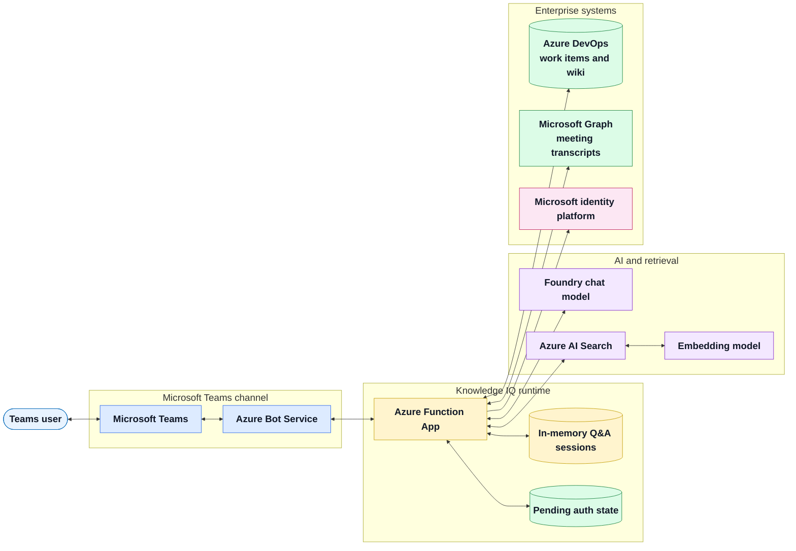
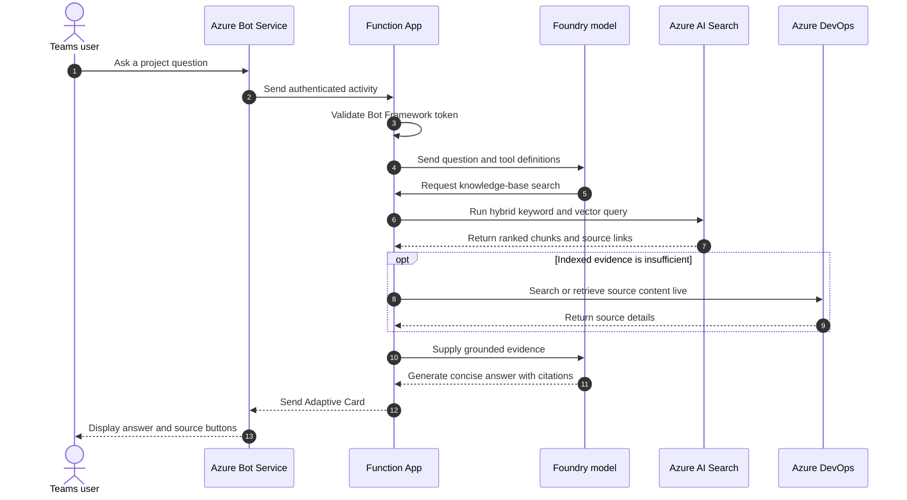
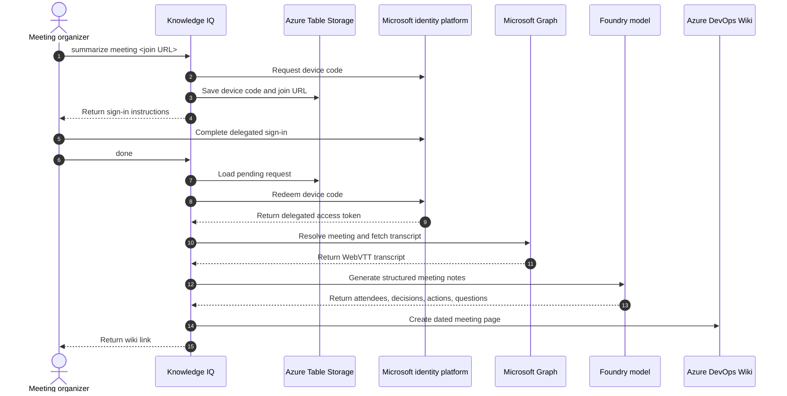
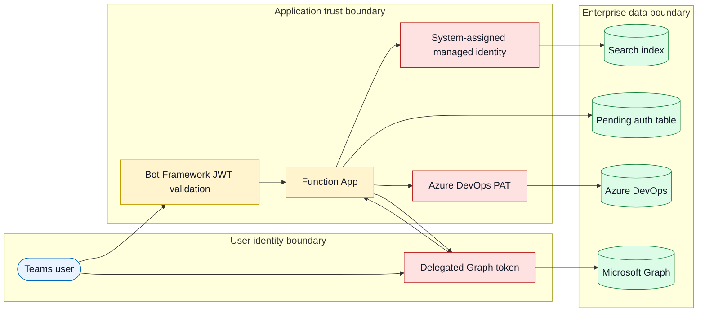
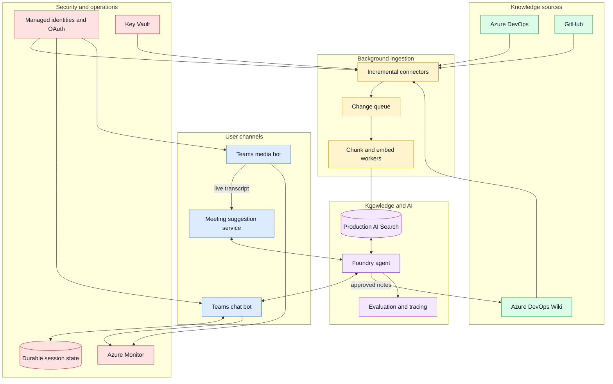

## Executive overview

Knowledge IQ is a Microsoft Teams assistant that turns Azure DevOps content into
accessible, cited answers and converts completed Teams meeting transcripts into
structured wiki notes.

The current solution is a modular Python application deployed as one Azure Function
App. It integrates Teams, Azure Bot Service, Microsoft Foundry, Azure AI Search,
Azure DevOps, Microsoft Graph, and Azure Storage. This design keeps the pilot small
while separating the code by responsibility so individual workloads can move to
dedicated services as demand grows.

### Business value

* Reduces time spent searching across work items and wiki pages
* Answers in Teams with links to the supporting source material
* Converts meeting transcripts into reusable decisions and action items
* Establishes a shared retrieval layer for future GitHub content and live meeting
  assistance

### Delivery snapshot

| Capability | Status | Current experience |
|------------|--------|--------------------|
| Azure DevOps Q&A | Delivered | Hybrid search across work items and wiki pages, with live API fallback |
| Source citations | Delivered | Adaptive Card responses link to source work items and wiki pages |
| Knowledge refresh | Delivered | Full refresh every six hours and on-demand refresh with `reindex now` |
| Meeting summary | Pilot | User-authorized transcript retrieval, AI summary, and wiki write-back |
| GitHub knowledge | Planned | Issues, pull requests, and code are not indexed today |
| Live meeting suggestions | Planned | Requires a real-time Teams media bot and proactive meeting messages |

## Architecture principles

* Ground every answer in approved enterprise content and return source links.
* Use managed identity for Azure service-to-service access where supported.
* Keep source adapters, retrieval, orchestration, and channel handling modular.
* Start with post-meeting processing before introducing real-time media complexity.
* Prefer a small operational footprint during validation, then separate workloads
  when scale, latency, or reliability requires it.

## Current architecture

The deployed system uses one Function App as the orchestration and compute boundary.
Q&A and meeting summarization share the same Foundry model integration but follow
separate processing paths.

### Diagram color key

| Color | Meaning |
|-------|---------|
| Blue | User and Teams channel |
| Amber | Application runtime and transient processing state |
| Purple | AI models and retrieval services |
| Green | Enterprise data and durable application state |
| Pink | Identity and delegated authorization |

## Q&A processing flow

The indexed knowledge base is the preferred retrieval path. Direct Azure DevOps API
calls provide a fallback when indexed results are insufficient and provide detailed
lookups for a known work item ID or wiki path.

### Retrieval and indexing

1. A timer trigger runs every six hours, or a user invokes `reindex now`.
2. The indexer reads all Azure DevOps work items and wiki pages.
3. Content is split into chunks of approximately 3,000 characters.
4. `text-embedding-3-small` generates a vector for each chunk.
5. Chunks are merged into `knowledge-iq-index`; stale chunks are removed.
6. At query time, keyword and vector results are ranked together.

This is a full-source refresh, not a delta sync. It is appropriate for the current
pilot volume but will become slower and more expensive as content grows.

## Meeting summary flow

Meeting summarization is asynchronous and post-meeting. The bot does not join the
call or process live audio. The meeting organizer authorizes transcript access by
using the device code flow.

The flow currently works only when the signed-in user organized the meeting,
transcription was enabled, and tenant Conditional Access policy permits the device
code flow. End-to-end validation with a production meeting remains a pilot exit
criterion.

## Component responsibilities

| Component | Responsibility | Authentication |
|-----------|----------------|----------------|
| Microsoft Teams | User interaction in personal, team, and group chat | Teams identity |
| Azure Bot Service | Teams channel registration and Bot Framework message relay | Single-tenant bot registration |
| Azure Function App | Request validation, command routing, agent tools, indexing, and summarization | Managed identity and app credentials |
| Microsoft Foundry | Chat completion and transcript summarization | Function managed identity |
| Azure AI Search | Hybrid retrieval over indexed Azure DevOps content | Function managed identity |
| Azure DevOps | Work item and wiki read access; meeting-note write-back | Shared project PAT |
| Microsoft Graph | Organizer meeting lookup and transcript retrieval | Delegated user token |
| Azure Table Storage | Pending meeting authorization state | Function storage connection |

## Security and data boundaries

### Security posture

* Inbound Bot Framework activities are validated before processing.
* Managed identity avoids keys for Foundry and Azure AI Search.
* Model calls disable provider-side conversation storage.
* Meeting access is delegated to the organizer and limited to transcript read scope.
* Pending device codes are stored in Azure Table Storage and deleted after token
  redemption or terminal failure.
* The Azure DevOps PAT is the main credential risk. It is shared by read and write
  paths and must be rotated because it has previously been exposed.
* Meeting transcripts and summaries can contain sensitive information. Retention,
  access control, and consent requirements must be agreed before production rollout.

## Deployment view

All current resources are deployed in `eastus2` within resource group
`rg-knowledge-iq-agent-dev-005cbe47`.

| Azure resource | Purpose | Current tier or mode |
|----------------|---------|----------------------|
| `knowledgeiq-relay-bot` | Teams channel and bot registration | Single tenant |
| `func-knowledgeiq-relay-cpvzgdnu` | Bot, agent tools, indexer, and meeting workflow | Linux Consumption |
| `EastUS2LinuxDynamicPlan` | Function hosting plan | Consumption |
| `stkiqrelaycpvzgdnu` | Function runtime storage and pending auth table | Storage account |
| `search-knowledgeiq-cpvzgdnu` | Hybrid knowledge index | Free tier |
| `cog-3y7mapyaibvjm` | Foundry account and model deployments | `gpt-5.4-mini`, `text-embedding-3-small` |
| Application Insights | Function telemetry | Runtime monitoring |

## Constraints and production risks

| Priority | Constraint or risk | Impact | Recommended action |
|----------|--------------------|--------|--------------------|
| High | Azure DevOps uses a shared PAT | Broad credential exposure affects read and write operations | Rotate immediately, store in Key Vault, then replace with scoped OAuth or workload identity |
| High | Q&A sessions are held in Function memory | Context is lost on restart or scale-out | Move session state to Cosmos DB or another durable distributed store |
| High | Meeting workflow is not validated end to end in production | Pilot capability may fail under real tenant policies or transcript conditions | Run a scripted organizer meeting test and capture operational evidence |
| Medium | Search runs on the Free tier | No SLA and limited capacity | Establish volume and availability targets, then select a production tier |
| Medium | Every refresh reads and embeds all content | Refresh cost and duration grow with content volume | Add changed-date and ETag-based delta synchronization |
| Medium | Device code flow may be blocked by Conditional Access | Meeting summaries are unavailable in restricted tenants | Validate tenant policy and design an approved delegated or application flow |
| Medium | One Function hosts interactive and scheduled workloads | Reindexing can contend with chat traffic | Separate indexing when measured latency or scale requires it |
| Low | GitHub content is absent | Answers cover only Azure DevOps sources | Add a least-privilege GitHub App connector |

## Target architecture

The target separates interactive chat, background ingestion, and real-time meeting
media. Shared retrieval and governance services support every channel.

## Delivery roadmap

| Stage | Outcome | Exit criteria |
|-------|---------|---------------|
| 1. Harden the pilot | Secure and reliable current capabilities | PAT rotated, secrets externalized, durable sessions, meeting test passed, alerting enabled |
| 2. Improve knowledge operations | Scalable and measurable retrieval | Delta indexing, production Search tier, representative Q&A evaluation suite |
| 3. Expand source coverage | Unified engineering knowledge | GitHub issues, pull requests, and selected code indexed with source filters |
| 4. Enable live assistance | Timely suggestions during meetings | Media bot validated, consent model approved, relevance thresholds measured, suggest-only rollout completed |

## Key architecture decisions

| Decision | Rationale | Revisit when |
|----------|-----------|--------------|
| Modular monolith on Azure Functions | Minimizes pilot cost and operational overhead | Indexing affects chat latency or workloads need independent scaling |
| Hybrid retrieval before live API fallback | Improves semantic recall while retaining precise source lookup | Evaluation shows another retrieval strategy performs better |
| Post-meeting transcripts before live audio | Delivers summary value without a media bot service | Live suggestions receive funding and governance approval |
| Delegated meeting access | Preserves user context and avoids broad tenant-wide access | Organization-wide meeting automation is approved |
| Human-visible citations | Supports trust, verification, and source navigation | This remains a permanent product requirement |

## Presentation summary

Knowledge IQ has a working Azure DevOps Q&A foundation and a pilot meeting-summary
workflow. The architecture deliberately favors low operational cost and rapid
validation. Production readiness depends on credential remediation, durable state,
measured retrieval quality, and a completed real-meeting test. GitHub ingestion and
live meeting suggestions are clear next-stage capabilities, not features of the
current deployment.