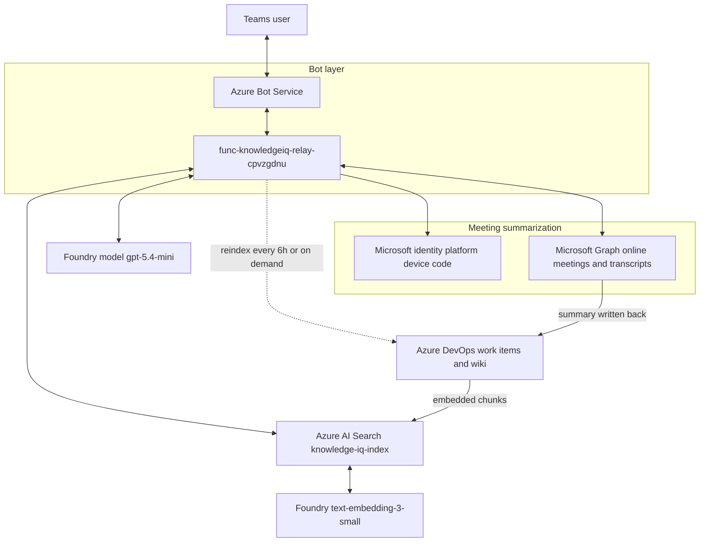
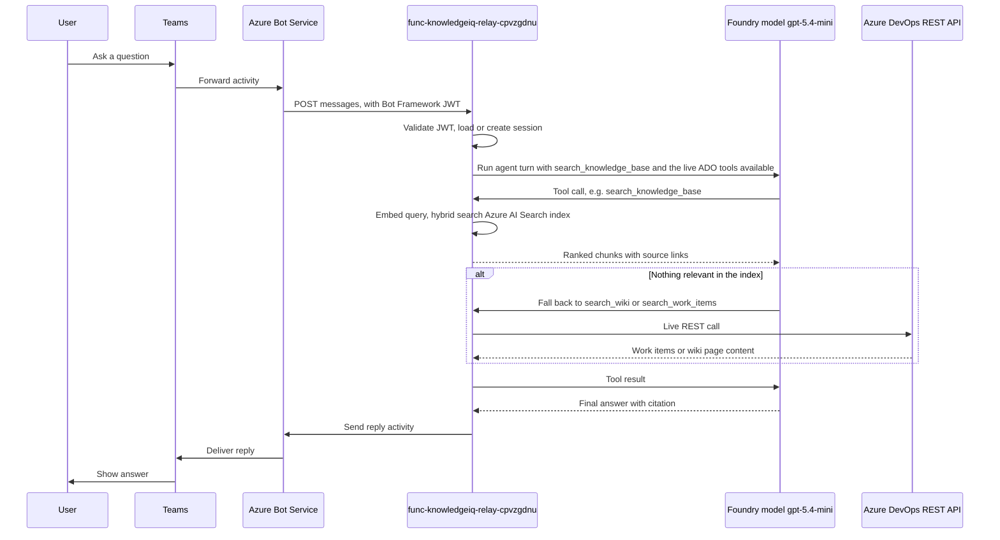
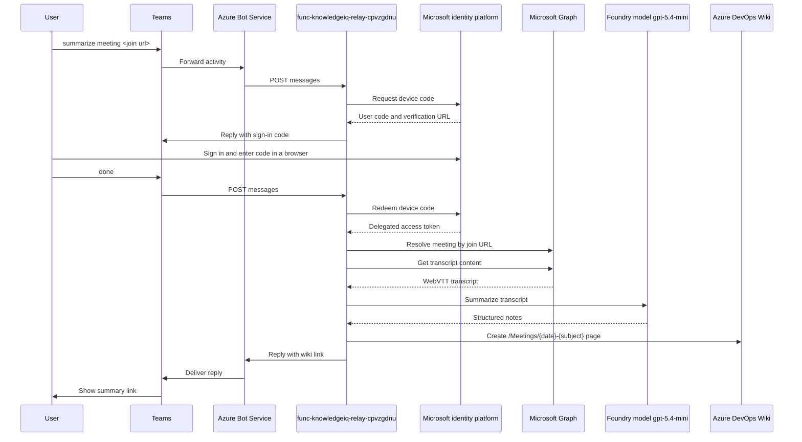
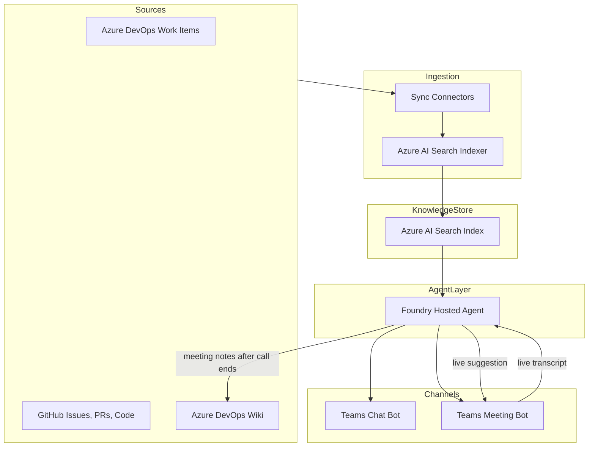

## Overview

Knowledge IQ is a Microsoft Teams bot that connects an organization's Azure DevOps work items, GitHub repositories, and Azure DevOps wiki into a single conversational assistant. The bot answers questions in chat, joins meetings to capture discussion and write summaries back to the wiki, and offers live suggestions during meetings by grounding the conversation in existing wiki knowledge.

The plan below is organized into three phases that map to the three requested features. Phase 1 is the recommended starting point because it delivers standalone value and produces the retrieval and indexing components that Phases 2 and 3 depend on.

## Goals and non-goals

* Goal: answer natural-language questions using Azure DevOps work items, GitHub issues/PRs/code, and Azure DevOps wiki pages as grounding sources.
* Goal: join a Teams meeting on invitation, capture a transcript, and publish structured notes back to the wiki.
* Goal: during a meeting, detect the topic under discussion and surface relevant wiki knowledge automatically or on request.
* Non-goal (initial phases): editing or closing work items on behalf of users, voice output/TTS responses in meetings, support for meeting platforms other than Teams.

## Architecture style

The deployed system is a **modular monolith**: one Azure Function App (`func-knowledgeiq-relay-cpvzgdnu`) is the single unit of deployment and scaling for the Q&A agent, meeting summarization, and search indexing, but the code is split by responsibility into separate modules (`ado_client.py`, `search_indexer.py`, `meeting_auth_store.py`, `graph_meeting_client.py`) rather than one script. See [Current flow](#current-flow) for the deployed component diagram.

The bot itself exposes one inbound API surface: a single Bot Framework `messages` webhook that Teams posts every activity to, dispatched internally by content (plain question, `reindex now`, `summarize meeting`, `done`). Outbound, it is a consumer of several external REST APIs — Azure DevOps (work items, wiki), Microsoft Graph (meetings, transcripts), Azure AI Search, and the Foundry model/embedding endpoints — plus one time-based trigger (the 6-hour reindex timer) rather than a purely request-driven design.

## Recommended stack

| Concern | Recommendation | Why |
|---|---|---|
| Agent orchestration | Microsoft Foundry hosted agent | Managed agent runtime with tool calling, evaluation, and CI/CD support already covered by the `microsoft-foundry` skill in this environment |
| Grounding model | Azure OpenAI model deployed through Foundry | Native integration with Foundry agents and tracing |
| Knowledge store | Azure AI Search (hybrid vector and keyword) | Purpose-built for RAG, supports incremental indexers |
| Data connectors | Azure DevOps REST API, GitHub REST/GraphQL API, Azure DevOps Wiki REST API | Official APIs, support incremental sync via timestamps/ETags |
| Chat channel | Azure Bot Service with Teams channel (Bot Framework SDK) | Standard way to expose a conversational bot inside Teams |
| Meeting join and audio | Microsoft Graph Communications API (calling and media bot) | Only supported path for a bot to join a Teams meeting and access real-time audio |
| Speech to text | Azure AI Speech, real-time transcription with speaker diarization | Needed to turn meeting audio into attributable transcript text |
| Secrets and identity | Microsoft Entra ID app registrations, Azure Key Vault, managed identity | Avoids storing PATs or client secrets in code |
| Hosting | Azure Container Apps for the bot and media processing services | Scales independently, supports the long-running media bot process separately from the chat bot |

## Feature 1: knowledge Q&A (MVP)

### Scope

Users chat with the bot in Teams (or a test console) and ask questions about work items, code, issues, or documented decisions. The bot retrieves relevant passages and answers with citations back to the source item.

### Components

* Connectors that pull data on a schedule or via webhooks:
  * Azure DevOps work items through the WIQL and work item REST APIs, including title, description, comments, state, and links.
  * GitHub issues, pull requests, and README/code comments through the REST or GraphQL API.
  * Azure DevOps wiki pages through the Wiki REST API, including page path and content.
* A chunking and embedding pipeline that normalizes each source type into a common document schema (id, source, title, url, text, last-updated) before indexing.
* An Azure AI Search index configured for hybrid search (vector plus keyword) with metadata filters for source type, project, and date.
* A Foundry hosted agent with a retrieval tool bound to the search index, plus source-specific tools (get work item by id, get PR by number) for direct lookups that do not require semantic search.
* A Bot Framework bot registered in Azure Bot Service and published to Teams, forwarding user messages to the agent and rendering citations as Adaptive Cards.

### Build steps

1. Register a Microsoft Entra ID app for the connectors with least-privilege scopes (`vso.work_read`, `vso.wiki_read` for Azure DevOps; `repo`/`read:org` scoped GitHub App or PAT stored in Key Vault).
2. Stand up an Azure AI Search service and define the document schema and vector field.
3. Implement the three connectors as scheduled jobs (Azure Functions timer trigger is a good fit) that pull deltas and push documents to the search index.
4. Create the Foundry hosted agent with a retrieval tool and per-source lookup tools, following the `microsoft-foundry` skill's `create` and `deploy` workflows.
5. Register an Azure Bot Service resource, add the Teams channel, and connect it to the agent.
6. Add evaluation datasets (sample questions with expected sources) and run the Foundry evaluation workflow before wider rollout.

### Implementation status (as of 2026-09-16)

Delivered with a simpler live-query architecture instead of the indexed design above. Revisit this section before starting Feature 2 or any further Feature 1 work.

| Component | Status | Notes |
|---|---|---|
| Azure DevOps work items (search + get by id) | Done | WIQL search over title/description, no work item type filter, so Bugs/Tasks/User Stories are all covered |
| Azure DevOps wiki (search + get page) | Done | Verified end to end with real content |
| GitHub issues/PRs/code connector | Not implemented | Descoped early ("assume Azure DevOps wiki as only data source") and never revisited |
| Azure AI Search hybrid index | Done | ADO-only (GitHub skipped by request); Free tier `search-knowledgeiq-cpvzgdnu`, hybrid vector plus keyword, `text-embedding-3-small` embeddings via the existing Foundry account |
| Scheduled sync connectors | Done | Timer-triggered reindex every 6 hours, plus an on-demand `reindex now` bot command; re-embeds all content each run rather than syncing deltas |
| Teams chat channel | Done | Delivered via a classic Bot Framework relay (Azure Function) rather than a native Foundry Activity-protocol hosted agent, which was abandoned after an unresolvable preview SDK bug (`azure-ai-agentserver-activity==1.0.0b1`) |
| Citations back to source | Done | Replies include work item and wiki URLs |
| Adaptive Cards | Not implemented | Bot replies are plain text |
| Least-privilege Entra app for connectors | Partial | Using a PAT (`ADO_PAT`) rather than a scoped OAuth app; this PAT has been exposed in chat multiple times and should be rotated |
| Evaluation dataset | Partial | Generated for the Foundry Responses-protocol agent (`knowledge-iq-agent`), not re-run against the Teams relay bot |

Deployed assets: Teams relay bot `knowledgeiq-relay-bot` backed by Azure Function `func-knowledgeiq-relay-cpvzgdnu`, plus Azure AI Search service `search-knowledgeiq-cpvzgdnu` for indexed Q&A. The original standalone Foundry hosted agent (`knowledge-iq-agent`) was deleted as redundant once the relay bot proved to cover the same Q&A capability end to end. See [Current flow](#current-flow) for the diagrams, resource inventory, and known limitations.

## Feature 2: meeting capture and wiki write-back

### Scope

Users invite the bot to a Teams meeting. The bot joins as a media-enabled participant, transcribes the discussion, and writes a structured summary back to a wiki page after the meeting.

### Components

* A Graph Communications API calling bot that accepts the meeting invite and joins as a bot participant with audio access.
* Azure AI Speech real-time transcription with diarization, streaming meeting audio to text with speaker labels.
* A post-meeting summarization step where the Foundry agent turns the raw transcript into structured notes: attendees, decisions, action items, open questions.
* A wiki write-back tool that calls the Azure DevOps Wiki REST API to create or update a page under a configured path (for example `/Meetings/{date}-{title}`).

### Build steps

1. Register a bot with Microsoft Graph calling permissions (`Calls.AccessMedia.All`, `Calls.JoinGroupCall.All`) and complete the Teams meeting bot onboarding, which requires a media processing endpoint separate from the chat bot.
2. Implement the media bot on Azure Container Apps or a service with predictable low-latency networking, since real-time audio processing is sensitive to cold starts.
3. Wire the media bot's audio stream into Azure AI Speech for real-time transcription with diarization.
4. Extend the Foundry agent with a summarization prompt and a wiki write-back tool, reusing the read connector from Feature 1 for the write path.
5. Add consent and recording-notice handling, since meeting recording triggers organizational compliance and, in many regions, legal notice requirements.

### Implementation status (as of 2026-09-16)

Delivered with a lighter, delegated-auth pivot instead of the live audio-capture design above, since it needs no Teams Administrator role and no new hosting.

| Component | Status | Notes |
|---|---|---|
| Delegated sign-in (device code flow) | Done | Uses Microsoft's public "Microsoft Graph Command Line Tools" client, no app registration or Teams Administrator role required |
| Resolve meeting by join URL | Done | `GET /me/onlineMeetings?$filter=JoinWebUrl eq ...` |
| Fetch and parse transcript | Done | WebVTT converted to speaker-attributed plain text; only covers meetings the signed-in user organized |
| Summarize into structured notes | Done | Attendees, Decisions, Action Items, Open Questions, via the same Foundry model |
| Write summary back to wiki | Done | New `ado_client.create_wiki_page`, path convention `/Meetings/{date}-{subject}` |
| Teams bot commands (`summarize meeting`, `done`) | Done | Added to the existing relay bot, smoke-tested via Direct Line |
| End-to-end test against a real Teams meeting | Pending | Needs a real meeting with transcription enabled to fully validate |
| Live Graph Communications calling bot, real-time audio | Not implemented | The heavier design above; would need a .NET service, since the Graph Calling SDK has no Python support |
| Org-wide use (reading other users' meetings) | Not implemented | Requires a Teams Administrator to create an application access policy; only the signed-in user's own meetings work today |

See [Current flow](#current-flow) for the meeting summarization sequence diagram and component detail.

## Feature 3: live meeting suggestions

### Scope

While the bot is in the meeting, it continuously compares the live transcript against the Feature 1 knowledge index. When it detects a topic with strong matches, it either responds automatically in the meeting chat or posts a suggestion card, depending on configuration.

### Components

* A streaming topic-detection step that runs over rolling transcript windows (for example the last 30 to 60 seconds) rather than the full transcript, to keep suggestions timely.
* A relevance gate that only triggers a suggestion when search results exceed a confidence threshold, to avoid noisy or irrelevant interruptions.
* A meeting chat responder that posts suggestions as Adaptive Cards in the meeting chat through the Bot Framework conversation tied to that meeting.
* A configuration setting per meeting or per team for auto-respond versus suggest-only mode.

### Build steps

1. Reuse the Feature 2 transcript stream and add a sliding-window buffer with topic segmentation.
2. Reuse the Feature 1 retrieval tool for topic queries, tuning the relevance threshold with recorded meeting samples before enabling auto-respond.
3. Implement suggestion delivery as proactive messages into the meeting's chat thread through the Bot Framework conversation reference captured at join time.
4. Start in suggest-only mode for all meetings and require explicit opt-in per team before enabling auto-respond, since incorrect automatic responses are more disruptive than a delayed suggestion.

### Implementation status (as of 2026-09-16)

Not implemented. Two things are verified, the rest is still open:

* Admin consent for `Calls.AccessMedia.All` and `Calls.JoinGroupCall.All` was granted on the relay bot's app registration without issue, confirming this does not require a Teams Administrator role.
* Whether real-time media access actually works at call time, separate from consent, is unverified. It can only be confirmed by building the .NET Graph Calling SDK client and attempting a live join.
* A lighter, no-new-permissions alternative is possible today: invite the existing relay bot into a meeting's chat and let users `@mention` it with questions, the same Q&A flow as Feature 1. This only supports on-request answers, not automatic topic detection from live audio.

## Cross-cutting concerns

* Authentication and authorization: use Microsoft Entra ID for user identity in Teams, and separate managed identities or app registrations per connector so each integration holds only the scopes it needs.
* Secrets: store Azure DevOps PATs, GitHub credentials, and any API keys in Azure Key Vault, referenced by managed identity, never checked into source control.
* Data governance: meeting transcripts and wiki write-backs may contain sensitive discussion. Apply retention policies and restrict the wiki write path to a dedicated meetings section with appropriate permissions.
* Observability: use the Foundry agent's built-in tracing and evaluation tooling to monitor answer quality, and Azure Monitor/Application Insights for the bot and connector services.
* Incremental indexing: design connectors to sync deltas (using `System.ChangedDate` in Azure DevOps and `updated_at` in GitHub) rather than re-indexing all content on every run.

## Suggested delivery order

1. Feature 1: connectors, search index, Foundry agent, Teams chat bot. This is the requested MVP and the foundation for the other two features.
2. Feature 2: meeting join, transcription, and wiki write-back, reusing the agent and wiki tool from Feature 1.
3. Feature 3: live suggestions, reusing the transcript pipeline from Feature 2 and the retrieval tool from Feature 1.

## Open questions to confirm before implementation

* Which Azure DevOps organization(s) and GitHub repositories are in scope for the initial index.
* Expected data volume (work item count, repository count, wiki page count) to size the Azure AI Search tier.
* Who can invite the bot to meetings and which meetings are in scope, for consent and compliance planning.
* Target wiki location and page naming convention for meeting notes.

## Current flow

What is actually deployed as of 2026-09-17: a single Azure Function doing double duty as the Q&A agent and the meeting-summarization orchestrator, now backed by an Azure AI Search index for the Q&A path. There is still no GitHub connector and no live-audio meeting bot.

### Chat Q&A turn

* Azure Bot resource `knowledgeiq-relay-bot`, registered as SingleTenant, with the Teams channel enabled, and a sideloaded Teams app package (`knowledgeiq-relay-teams-app.zip`) for personal, team, or group chat scope.
* Entra ID app registration `MicrosoftAppId=0cbb69cf-b392-4451-b99b-eccabed08da3` used for both inbound activity validation and outbound reply authentication.
* Function App `func-knowledgeiq-relay-cpvzgdnu` (Linux Consumption plan `EastUS2LinuxDynamicPlan`) is the only compute component. Its `messages` route validates every inbound Bot Framework JWT in code, then replies through `ConnectorClient.conversations.send_to_conversation`. It holds an in-memory session dictionary keyed by Teams conversation id, so multi-turn context lasts only for the life of the function instance.
* A system-assigned managed identity (`0b48ae88-06f7-4bcf-ac32-f3ea83336f26`) grants the Function access to the Foundry account and the Search service, no PAT or key needed for either.
* An in-process `Agent` (Agent Framework) is built directly inside the Function App using `FoundryChatClient` against Foundry account `cog-3y7mapyaibvjm`, project `knowledge-iq-ai`, model deployment `gpt-5.4-mini`. This is not a separately hosted Foundry agent.
* `search_indexer.py` embeds and upserts Azure DevOps content into `knowledge-iq-index` (Azure AI Search, Free tier), refreshed every 6 hours by a timer trigger or on demand via the `reindex now` bot command; `search_knowledge_base` is the agent's preferred tool, with the older live ADO search tools kept as a fallback.
* `ado_client.py` inside the Function App calls Azure DevOps REST APIs directly and live for the fallback tools and for `get_work_item`/`get_wiki_page` detail lookups, authenticating with a personal access token (`ADO_PAT` app setting) rather than a scoped Entra app.

### Meeting summarization turn

* `graph_meeting_client.py` implements the device code request/redeem and the Graph calls, using Microsoft's public "Microsoft Graph Command Line Tools" client. No app registration change or Teams Administrator role is required.
* Pending sign-in state (`device_code`, `join_url`) is stored per conversation in an Azure Table Storage table (`PendingMeetingAuth`), reusing the Function App's existing storage account (`AzureWebJobsStorage`), not in memory, so it survives across the two separate requests the flow needs.
* `ado_client.create_wiki_page` writes the summary, reusing the same PAT-authenticated client as the Q&A read path. The meeting subject is slugified before use in the page path to avoid characters ADO wiki paths reject.
* Only meetings the signed-in user personally organized can be read, since this uses the delegated `/me/onlineMeetings` scope. Reading other users' meetings would need an application-permission flow gated behind a Teams Administrator-only application access policy.
* In one production tenant tested, this sign-in was rejected by a Conditional Access policy restricting the authentication flow; it succeeded cleanly in a separate Microsoft 365 developer/test tenant, confirming the block is tenant policy, not an issue with this implementation.

### Deployed resource inventory

All resources live in resource group `rg-knowledge-iq-agent-dev-005cbe47` (`eastus2`), subscription `f3d6b6b0-1c3e-4194-aced-57f1f90bb945`.

| Resource | Type | Role |
|---|---|---|
| `cog-3y7mapyaibvjm` | Microsoft.CognitiveServices/accounts | Foundry account hosting the model deployment |
| `cog-3y7mapyaibvjm/knowledge-iq-ai` | Microsoft.CognitiveServices/accounts/projects | Foundry project used by the relay bot |
| `func-knowledgeiq-relay-cpvzgdnu` | Microsoft.Web/sites | The relay bot's compute |
| `EastUS2LinuxDynamicPlan` | Microsoft.Web/serverFarms | Consumption hosting plan for the function |
| `stkiqrelaycpvzgdnu` | Microsoft.Storage/storageAccounts | Function App storage, also backs the pending-meeting-auth table |
| `func-knowledgeiq-relay-cpvzgdnu` | Microsoft.Insights/components | Application Insights for the function |
| `knowledgeiq-relay-bot` | Microsoft.BotService/botServices | Bot Service registration with the Teams channel |
| `search-knowledgeiq-cpvzgdnu` | Microsoft.Search/searchServices | Free tier, hosts `knowledge-iq-index` for hybrid Q&A search |
| `cog-3y7mapyaibvjm/text-embedding-3-small` | Microsoft.CognitiveServices/accounts/deployments | Embedding model used to vectorize indexed content and queries |

### Known limitations

* Q&A session state is in-memory only. A function restart or scale event loses conversation context.
* The search index is reindexed in full every 6 hours (or on demand), rather than syncing only changed items; fine at current content volume, wasteful and slower as the wiki or backlog grows.
* The Search service is on the Free tier: 50 MB storage, 3 indexes maximum, no SLA. Adequate for validating the design, not for production load.
* The Azure DevOps PAT is a single shared credential with read access to the whole project, rather than a scoped app registration. It has been exposed in chat multiple times and should be rotated.
* No evaluation suite has been run against the relay bot directly. The evaluation suite generated earlier in the project targeted the standalone Foundry agent, which has since been deleted.
* Meeting summarization only works for meetings the signed-in user personally organized, and can be blocked entirely by a tenant's Conditional Access policy.

## Final flow (end result)

The required architecture once Feature 1, Feature 2, and Feature 3 are all fully implemented. This combines the original Feature 1 design (search index, GitHub connector) with Feature 2's live-audio meeting bot and Feature 3's live-suggestion loop into one target picture. This is what the phased build-out above works toward, not what is running today.

