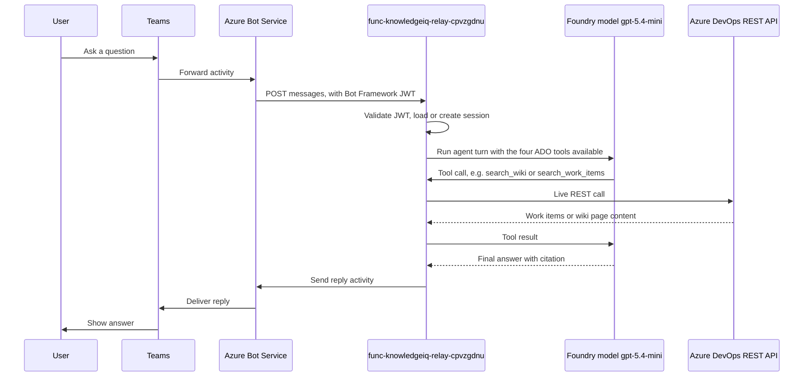

## Overview

This describes what is actually deployed and running for Feature 1 today, as opposed to the original design in [architecture.md](./architecture.md). The delivered solution answers questions in Microsoft Teams using live data from Azure DevOps work items and the Azure DevOps wiki. It intentionally diverges from the original plan in a few places, noted below.

## Components in use

### Microsoft Teams and Bot Service

* Azure Bot resource `knowledgeiq-relay-bot`, registered as SingleTenant, with the Teams channel enabled.
* A sideloaded Teams app package (`knowledgeiq-relay-teams-app.zip`) that end users install to chat with the bot in personal, team, or group chat scope.
* Entra ID app registration `MicrosoftAppId=0cbb69cf-b392-4451-b99b-eccabed08da3` used for both inbound activity validation and outbound reply authentication.

### Azure Function relay

* Function App `func-knowledgeiq-relay-cpvzgdnu` (Linux Consumption plan `EastUS2LinuxDynamicPlan`), the single compute component in the solution.
* HTTP-triggered `messages` route, anonymous auth at the platform level, with Bot Framework JWT validation performed in code (`JwtTokenValidation.authenticate_request`).
* Validates every inbound activity from the Bot Connector, then replies through `ConnectorClient.conversations.send_to_conversation`.
* Holds an in-memory session dictionary keyed by Teams conversation id, so multi-turn context lasts only for the life of the function instance.
* System-assigned managed identity (`0b48ae88-06f7-4bcf-ac32-f3ea83336f26`) grants access to the Foundry account, with no PAT or key needed for the model call.

### Agent and model

* Foundry account `cog-3y7mapyaibvjm`, project `knowledge-iq-ai`, model deployment `gpt-5.4-mini`.
* An in-process `Agent` (Agent Framework) built directly inside the Function App using `FoundryChatClient`, not a separately hosted Foundry agent. The Function calls the model deployment endpoint directly on every message.
* Four local tools registered on the agent: `search_work_items`, `get_work_item`, `search_wiki`, `get_wiki_page`.

### Azure DevOps connectors

* `ado_client.py` inside the Function App, calling Azure DevOps REST APIs directly and live, on every question. There is no ingestion pipeline and no search index.
* Work items: WIQL query over `System.Title` and `System.Description` using `CONTAINS`, with no work item type filter, so Bugs, Tasks, and User Stories are all searchable. Full details fetched through the batch work items API.
* Wiki: pages listed by walking the full page tree (`recursionLevel=full`), since the organization's Search extension is not installed and `almsearch` returns no results. `search_wiki` matches path and content client-side, and `get_wiki_page` fetches a single page by path.
* Authentication uses a personal access token (`ADO_PAT` app setting), not a scoped Entra app as originally planned.

## What is not implemented

* GitHub issues, pull requests, and code as a data source. Descoped early in favor of Azure DevOps only, and never revisited.
* Azure AI Search or any vector or hybrid index. Every question triggers live Azure DevOps API calls instead of a query against pre-indexed content.
* Scheduled or webhook-driven sync connectors. There is nothing to keep in sync, since there is no index.
* Adaptive Cards. Bot replies are plain text with inline source links.
* A dedicated least-privilege Entra app for the Azure DevOps connectors. A PAT is used instead.

## Data flow

## Deployed resource inventory

All resources live in resource group `rg-knowledge-iq-agent-dev-005cbe47` (`eastus2`), subscription `f3d6b6b0-1c3e-4194-aced-57f1f90bb945`.

| Resource | Type | Role |
|---|---|---|
| `cog-3y7mapyaibvjm` | Microsoft.CognitiveServices/accounts | Foundry account hosting the model deployment |
| `cog-3y7mapyaibvjm/knowledge-iq-ai` | Microsoft.CognitiveServices/accounts/projects | Foundry project used by the relay bot |
| `func-knowledgeiq-relay-cpvzgdnu` | Microsoft.Web/sites | The relay bot's compute |
| `EastUS2LinuxDynamicPlan` | Microsoft.Web/serverFarms | Consumption hosting plan for the function |
| `stkiqrelaycpvzgdnu` | Microsoft.Storage/storageAccounts | Function App storage |
| `func-knowledgeiq-relay-cpvzgdnu` | Microsoft.Insights/components | Application Insights for the function |
| `knowledgeiq-relay-bot` | Microsoft.BotService/botServices | Bot Service registration with the Teams channel |

## Known limitations

* Session state is in-memory only. A function restart or scale event loses conversation context.
* Live Azure DevOps calls on every question will not scale well against a large backlog or wiki, since there is no caching or indexing layer.
* The Azure DevOps PAT is a single shared credential with read access to the whole project, rather than a scoped app registration.
* No evaluation suite has been run against this relay bot directly. The evaluation suite generated earlier in the project targeted a separate hosted agent that has since been deleted.
